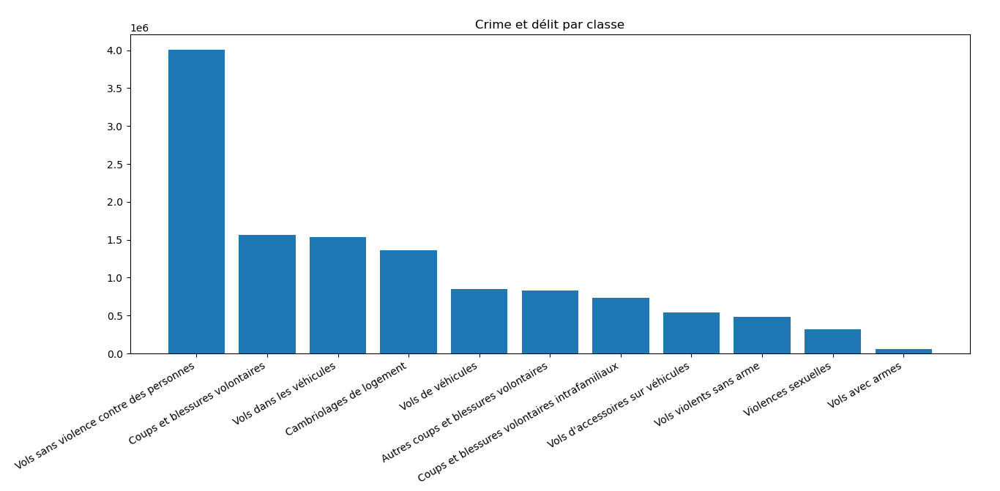
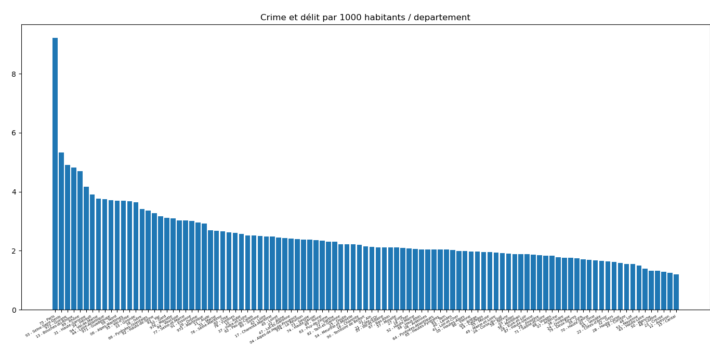
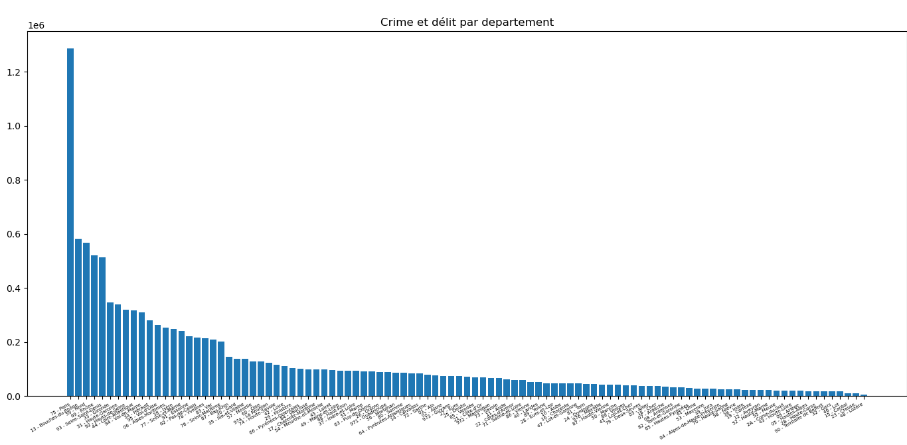
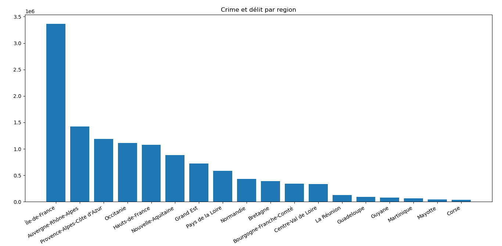

# Charts/Graphiques

**Ces graphiques ne montre que les données fourni par le gouvernement entre 2016 et 2022. Il est important de préciser que les plaintes classées n'y apparaissent pas (environ 3/4 sont classées en 2017). Il est aussi important de rappeler qu'il n'y a que les plaintes qui sont comptées (exemple: il n'y a que 12% des victimes de violences sexuelles qui portent plaintes, donc 88% de ces actes ne sont pas répertoriés).**

## Crimes et délits par classification

## Crimes et délits pour 1000 habitants

## Crimes et délits par département

## Crimes et délits par région

